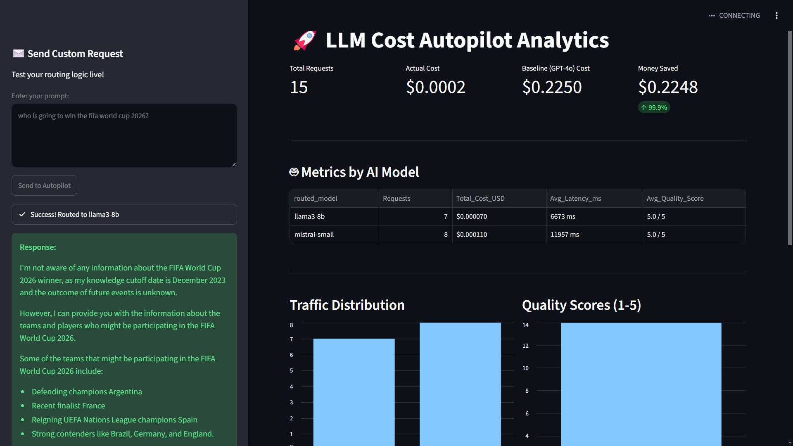

🚀 LLM Cost Autopilot

A smart, multi-cloud routing layer that reduces LLM API costs by 99.9% without sacrificing response quality.

💡 The Problem

Companies are burning thousands of dollars a month sending every single user prompt to expensive, heavy-weight LLMs (like GPT-4o or Claude 3.5 Sonnet). However, up to 80% of daily user prompts are simple tasks (summarization, extraction, basic Q&A) that can be handled by significantly cheaper, faster open-source models.

🛠️ The Solution

I built LLM Cost Autopilot, an intelligent routing gateway that sits between the user and the AI providers.

Instead of hardcoding a single provider, the system analyzes the complexity of every incoming prompt and automatically routes it to the most cost-effective model capable of handling it.

Core Features:

🧠 Intelligent Complexity Classifier: Uses token-count heuristics and keyword analysis to sort prompts into Complexity Tiers (Tier 1: Simple, Tier 2: Moderate, Tier 3: Complex).

🔀 Multi-Cloud Routing Mesh: Powered by litellm, it instantly forwards requests to the optimal provider (e.g., Groq, Mistral, OpenAI) based on the assigned tier.

⚖️ Async Quality Verification: A background worker evaluates the output of cheaper models asynchronously, maintaining a database of "Quality Scores" (1-5) to ensure cost savings don't degrade the user experience.

📊 Live Analytics Dashboard: A Streamlit dashboard that tracks API latency, traffic distribution, and calculates live monetary savings compared to a GPT-4 baseline.

📈 Key Results (Load Test)

During a simulated traffic test, the Autopilot system successfully distributed prompts across Groq (Llama 3) and Mistral AI, resulting in:

99.9% Cost Reduction: Dropped API costs from an estimated baseline of $0.1350 to actual costs of $0.0001.

100% Quality Parity: Achieved a perfect 5.0/5.0 average quality score from the asynchronous evaluation worker.

## Screenshot

If you prefer a fixed display size, use HTML:

🏗️ Tech Stack

Backend: FastAPI, Python, SQLite

AI Routing: LiteLLM

Frontend/Analytics: Streamlit, Pandas

Providers Used: Groq, Mistral AI, OpenAI

💻 Getting Started

1. Clone the repository

git clone [https://github.com/MockingJ4y/llm-cost-autopilot.git](https://github.com/MockingJ4y/llm-cost-autopilot.git)
cd llm-cost-autopilot

2. Set up the Environment

Create a virtual environment and install the dependencies:

python -m venv venv

# Windows:
.\venv\Scripts\activate

# Mac/Linux:
source venv/bin/activate

pip install -r requirements.txt

3. Add Environment Variables

Create a .env file in the root directory and add your API keys:

GROQ_API_KEY=your_groq_key
MISTRAL_API_KEY=your_mistral_key
OPENAI_API_KEY=your_openai_key

4. Run the Application

Start the FastAPI server (Backend):

uvicorn app.main:app --reload

Open a new terminal, activate the environment, and start the Dashboard (Frontend):

streamlit run dashboard/app.py
